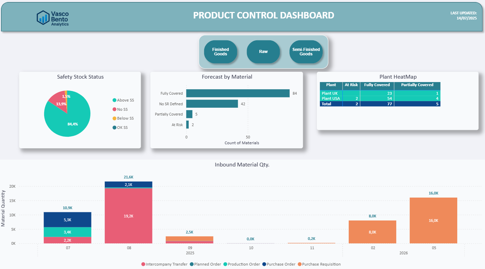

# Product Control Dashboard

A **Power BI cockpit** built for end-to-end Supply Chain control of a single product family.  
Switch between **Finished Goods / Raw / Semi-Finished** with one slicer and get instant, actionable answers:

| Card / Visual            | Why it matters                                               |
|--------------------------|--------------------------------------------------------------|
| **Safety-Stock Status**  | See, at a glance, what’s Above SS, OK, Below SS or has no SS |
| **Forecast by Material** | Spots Fully- vs Partially-covered SKUs & blind-spots         |
| **Plant HeatMap**        | Highlights risk by plant so ops teams know where to act      |
| **Inbound Timeline**     | Quantities × order-type for the next arrivals                |

  

---

## Key features

* **Dynamic KPI Slicer** – one click to pivot between FG, Raw, Semi-FG  
* **Automatic SS & SR Classification** – DAX driven, no manual tagging  
* **Heatmap with conditional formatting** – instantly flags plants “at risk”  
* **Inbound-mix stacked bar** – see Intercompany, Production, Purchase Order & Requisition in one bar  
* **Lightweight repo** – only the screenshot here; the live `.pbix` stays in its own private repo

---

## 🛠 Sample DAX snippets (see `/DAX` folder)

* `SS Status` calculated column  
* `Forecast Coverage Status` bucket (Fully / Partial / At Risk)  
* `Next Inbound Date Month` for clean timeline axes  
* `Materials Below SS` measure with switchable filters  

---

## ⚙️ About the project

This mock-up is based on SAP MM extractions (`MB5B`, `MB51`) but **all data is simulated/anonymised**.  
Goal: showcase **analytic storytelling** and **KPI monitoring** for Supply‐Chain decision support.

---

Author: <strong>Vasco Bento</strong> · <a href="https://www.linkedin.com/in/vascobento">LinkedIn</a>

